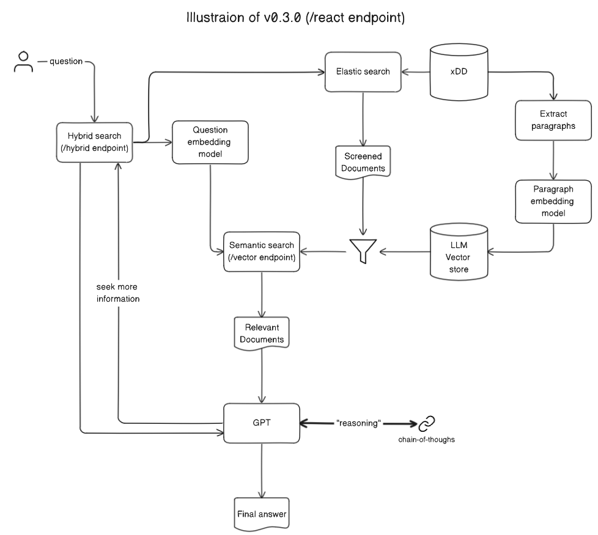

# ASK-xDD

Askem retrieval-augmented generation prototype

Repo: <https://github.com/UW-Madison-DSI/ask-xDD>

Demo: <https://xdddev.chtc.io/ask-xdd-demo>

API Base URL: <http://cosmos0002.chtc.wisc.edu:4502/>

## For end-users

The end users of our system are ASKEM performers who access it using REST API. You can also visit our [demo](http://cosmos0002.chtc.wisc.edu:8501/) to try how this system can power a traceable COVID-19 search engine.

### Release notes (v0.3.0)

#### Highlights

- Enhance performance tailored to Hackathon scenarios
- Integrate `ReAct` for better handling of complex queries
- Implement `hybrid` search to refine keyword query results

### Retriever overview



The retriever uses an embedding-based search engine, specifically [Dense Passage Retriever (DPR)](https://arxiv.org/abs/2004.04906), to query relevant documents from the XDD database. Currently, it returns `paragraphs` as documents. Future updates may include `figures`, `tables`, and `equations`. The API accepts **POST** requests and requires an **APIKEY**. ASKEM performers can obtain an API key by contacting [me](mailto:jason.lo@wisc.edu).

Base URL: <http://cosmos0002.chtc.wisc.edu:4502>

There are 3 endpoints available:

1. `vector`: Basic DPR vector search (Not recommended).
2. `hybrid`: Combines Elasticsearch pre-filtering with DPR vector search (Recommended, better performance).
3. `react`: Builds on the `hybrid` approach, integrating the [ReAct agent](https://react-lm.github.io/) for "reasoning" (via gpt-4 by default) and subsequent querying (via `hybrid` endpoint by default) to generate better answers. (Experimental, slow, highest performance).

### `vector` and `hybrid` endpoint example usage

Both `vector` and `hybrid` endpoints use similar format for request and response data.

```python
import requests

APIKEY = "insert_api_key_here"
ENDPOINT = "BASE_URL/hybrid"

headers = {"Content-Type": "application/json", "Api-Key": APIKEY}
data = {
    "topic": "covid",
    "question": "What is SIDARTHE model?",
    "top_k": 3,
}

response = requests.post(ENDPOINT, headers=headers, json=data)
response.json()
```

#### Request body schema for `vector` and `hybrid` endpoints

```python
{
    "question": str,
    "top_k": Optional[int] = 5, # Number of documents to return
    "distance": Optional[float] = None, # Max cosine distance between question and document
    "topic": Optional[str] = None, # Filter by topic, only "covid" is available now
    "doc_type": Optional[str] = None,  # Filter by document type, only "paragraph" is available now
    "preprocessor_id": Optional[str] = None,  # Filter by preprocessor_id, for developer use only
    "article_terms": Optional[List[str]] = None,  # Obsolete, do not use
    "paragraph_terms": Optional[List[str]] = None,  # Filter by capitalized terms (any word that has more than one capital letter) in the paragraph
    "paper_ids": Optional[List[str]] = None,  # Filter by XDD paper ids
    "move_to": Optional[str] = None,  # Move the answer to better match the context of the given string, like `mathematical equation`.
    "move_to_weight": Optional[float] = 0,  # Weight `move_to` parameter to adjusts the influence on the original answer, with a range from 0 to 1. Higher values mean stronger augmentation.
    "move_away_from": Optional[str] = None,  # Move the answer away from irrelevant topics, like `general commentary`.
    "move_away_from_weight": Optional[float] = 0,  # Weight `move_away_from` to adjusts the influence on the original answer, with a range from 0 to 1. Higher values mean stronger augmentation.
    "screening_top_k": Optional[int] = 100,  # `hybrid` endpoint only. Number of documents to return from the elastic search pre-filtering step.
}
```

#### Response body schema for `vector` and `hybrid` endpoints

```python
[
    {
        "paper_id": str,  # XDD paper id
        "doc_type": str,  # only "paragraph" for now
        "text": str,  # text content
        "distance": float,  # distance to question
        "cosmos_object_id": str,  # only available for doc_type="figure"
        "article_terms": List[str],  # Obsolete, do not use
        "paragraph_terms": List[str], # Capitalized terms in the paragraph
    },
    ...
]
```

### `react` endpoint example usage

```python
import requests

APIKEY = "insert_api_key_here"
ENDPOINT = "BASE_URL/react"

headers = {"Content-Type": "application/json", "Api-Key": APIKEY}
data = {
    "topic": "covid",
    "question": "What is SIDARTHE model?",
    "top_k": 3,
}

response = requests.post(ENDPOINT, headers=headers, json=data)
response.json()
```

#### Request body schema for `react` endpoint

```python
{
    "question": str,
    ..., # Same as `hybrid` endpoint, see
    "model_name": Optional[str] = "gpt-4",  # OpenAI llm model name
}
```

#### Response body schema for `react` endpoint

```python
{
    "answer": str,  # Final answer to the question
    "used_docs": list[Document],  # Relevant documents used to generate the answer, with the same schema as the response of `hybrid` endpoint
}
```

<details>
    <summary style="font-size: 1.5em;">For developer</summary>

### To deploy the system

1. Make a .env file in the project root directory with these variables

    see example: `.env.example`

    see shared [dotenv](https://docs.google.com/document/d/1TyGeHxbOShv_jzTIM7vn-equH0XB3wM0mBuAvYI0AR0/edit) file for the actual values

1. Run launch test

    ```sh
    bash ./scripts/launch_test.sh
    ```

1. Ingest documents

    Put all text files in a folder, with file format as `<ingest_dir>/<paper-id>.txt`, then run this:

    ```sh
    python askem/ingest_docs.py --input-dir "data/debug_data/paragraph_test" --topic "covid-19" --doc-type "paragraph" --weaviate-url "url_to_weaviate"
    ```

1. Ingest figures

    Put all text files in a folder, with file format as `<ingest_dir>/<paper-id>.<cosmos_object_id>.txt`, then run this:

    ```sh
    python askem/deploy.py --input-dir "data/debug_data/figure_test" --topic "covid-19" --doc-type "figure" --weaviate-url "url_to_weaviate"
    ```

### To add a new topic

1. In [retriever data models](askem/retriever/data_models.py), add new topic to `Topic` enum class
1. Ingest data with the new topic
1. Make sure xDD articles API has the new topic `dataset` available, they use the same name without any translation layer.
1. Add new preset demo questions to `askem/demo/present_questions`, e.g.: [climate change preset questions](askem/demo/preset_questions/preset_climate_change_q.txt)
1. Add `Topic` in [demo](askem/demo/app.py).

</details>
